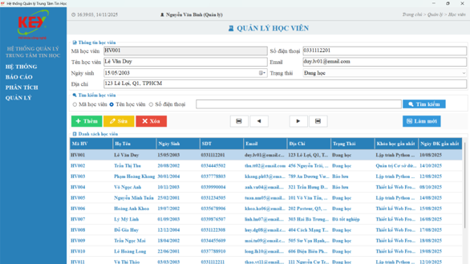
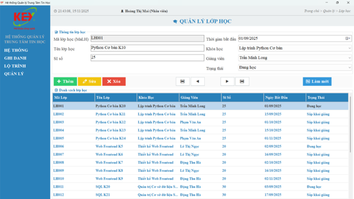
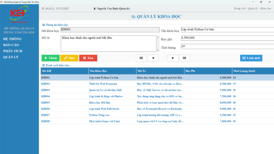

# Hệ Thống Quản Lý Trung Tâm Tin Học

## 1. Giới thiệu dự án

**Hệ thống Quản lý Trung tâm Tin học** là dự án học tập được xây dựng nhằm hỗ trợ quản lý các nghiệp vụ cơ bản tại một trung tâm đào tạo tin học, bao gồm quản lý học viên, khóa học, lớp học, giảng viên, đăng ký học và tra cứu thông tin.

Dự án tập trung vào việc phân tích yêu cầu, thiết kế hệ thống, mô hình hóa nghiệp vụ và xây dựng module chức năng cơ bản bằng C# kết hợp với cơ sở dữ liệu SQL.

---

## 2. Mục tiêu dự án

- Tin học hóa quy trình quản lý thông tin tại trung tâm Tin học.
- Hỗ trợ lưu trữ và tra cứu dữ liệu học viên, lớp học, khóa học.
- Giảm thao tác quản lý thủ công bằng giấy tờ hoặc Excel.
- Xây dựng mô hình hệ thống rõ ràng thông qua Use Case, UML và cơ sở dữ liệu.
- Rèn luyện kỹ năng phân tích yêu cầu, thiết kế hệ thống và lập trình ứng dụng quản lý.

---

## 3. Vai trò thực hiện

- Khảo sát và phân tích yêu cầu hệ thống.
- Xác định các tác nhân và chức năng chính của hệ thống.
- Xây dựng Use Case và mô hình nghiệp vụ bằng UML.
- Thiết kế cơ sở dữ liệu phục vụ quản lý trung tâm Tin học.
- Mô tả quy trình hoạt động của hệ thống.
- Đề xuất giải pháp cải tiến quy trình quản lý.
- Xây dựng module chức năng cơ bản bằng C#.

---

## 4. Công nghệ sử dụng

| Nhóm | Công nghệ / Công cụ |
|---|---|
| Ngôn ngữ lập trình | C# |
| Cơ sở dữ liệu | SQL Server / SQL |
| Phân tích thiết kế | UML, Use Case |
| Công cụ thiết kế | Draw.io / StarUML / Visual Paradigm |
| Môi trường phát triển | Visual Studio |
| Quản lý mã nguồn | GitHub |

---

## 5. Chức năng chính

### Quản lý học viên
- Thêm, sửa, xóa thông tin học viên.
- Tra cứu học viên theo mã, tên hoặc thông tin liên hệ.
- Lưu trữ thông tin cá nhân và lịch sử đăng ký học.

### Quản lý khóa học
- Quản lý danh sách khóa học.
- Lưu thông tin tên khóa học, thời lượng, học phí và nội dung đào tạo.
- Cập nhật trạng thái khóa học.

### Quản lý lớp học
- Tạo và cập nhật thông tin lớp học.
- Gán khóa học, giảng viên và lịch học cho từng lớp.
- Theo dõi số lượng học viên trong lớp.

### Quản lý đăng ký học
- Ghi nhận thông tin học viên đăng ký khóa học.
- Theo dõi lớp học mà học viên tham gia.
- Hỗ trợ tra cứu thông tin đăng ký.

### Tra cứu và thống kê
- Tìm kiếm thông tin học viên, lớp học, khóa học.
- Hỗ trợ thống kê cơ bản phục vụ công tác quản lý.

---

## 6. Một số giao diện hệ thống

> Thêm ảnh giao diện vào thư mục `screenshots`, sau đó thay tên file bên dưới cho đúng với ảnh đã upload.

### Màn hình chính

### Quản lý học viên

### Quản lý lớp học

### Quản lý khóa học

---

## 7. Mô hình phân tích thiết kế

Dự án có sử dụng các mô hình phân tích thiết kế nhằm mô tả rõ chức năng, dữ liệu và quy trình xử lý của hệ thống.

Một số mô hình có thể đưa vào repo:

- Use Case Diagram
- Class Diagram
- Activity Diagram
- Sequence Diagram
- ERD / mô hình cơ sở dữ liệu

Ví dụ:

---
