# Hệ Thống Quản Lý Trung Tâm Tin Học KEY

## 1. Giới thiệu dự án

**Hệ thống Quản lý Trung tâm Tin học KEY** là đồ án môn học **Phân tích và Thiết kế Hướng Đối Tượng**. Dự án được thực hiện nhằm phân tích, thiết kế và xây dựng chương trình minh họa cho một hệ thống quản lý trung tâm đào tạo tin học.

Hệ thống hỗ trợ quản lý các nghiệp vụ chính như học viên, giảng viên, nhân viên, khóa học, lớp học, lịch học, học phí, khuyến mãi, tài khoản người dùng, sao lưu dữ liệu và báo cáo thống kê.

Dự án tập trung vào việc áp dụng phương pháp phân tích thiết kế hướng đối tượng, sử dụng UML để mô tả cấu trúc, hành vi và luồng xử lý của hệ thống.

---

## 2. Bài toán đặt ra

Trong quá trình vận hành trung tâm tin học, các nghiệp vụ như tiếp nhận học viên, ghi danh khóa học, xếp lớp, phân công giảng viên, lập lịch học, thu học phí, quản lý khuyến mãi, điểm danh, nhập điểm và lập báo cáo thường dễ phát sinh sai sót nếu xử lý thủ công bằng Excel hoặc giấy tờ.

Vì vậy, dự án đề xuất xây dựng một hệ thống quản lý tập trung nhằm:
- Tự động hóa quy trình nghiệp vụ.
- Lưu trữ dữ liệu tập trung và nhất quán.
- Hỗ trợ tra cứu, cập nhật và xử lý thông tin nhanh chóng.
- Hỗ trợ báo cáo, thống kê và ra quyết định quản lý.
- Nâng cao hiệu quả vận hành tại trung tâm tin học.

---

## 3. Mục tiêu dự án

- Phân tích bài toán quản lý trung tâm tin học.
- Xác định yêu cầu chức năng và phi chức năng của hệ thống.
- Xây dựng sơ đồ Use Case tổng thể và Use Case chi tiết.
- Thiết kế các sơ đồ UML như Activity Diagram, Sequence Diagram, Collaboration Diagram, Class Diagram và State Diagram.
- Thiết kế kiến trúc hệ thống theo mô hình 3 tầng.
- Thiết kế cơ sở dữ liệu bằng Microsoft SQL Server.
- Xây dựng chương trình minh họa bằng C# Windows Forms.
- Minh họa các chức năng quản lý, nghiệp vụ, sao lưu dữ liệu và báo cáo thống kê.

---

## 4. Vai trò thực hiện

- Khảo sát và mô tả quy trình nghiệp vụ.
- Xác định tác nhân và danh sách chức năng hệ thống.
- Đặc tả các Use Case chính.
- Thiết kế sơ đồ hoạt động, sơ đồ tuần tự và sơ đồ cộng tác.
- Thiết kế sơ đồ lớp và sơ đồ trạng thái.
- Thiết kế cơ sở dữ liệu và ràng buộc dữ liệu.
- Xây dựng giao diện chương trình minh họa bằng C# Windows Forms.
- Kiểm thử các chức năng chính thông qua dữ liệu mẫu.
- Hoàn thiện báo cáo phân tích và thiết kế hướng đối tượng.

---

## 5. Công nghệ và công cụ sử dụng

| Nhóm | Công nghệ / Công cụ |
|---|---|
| Phân tích thiết kế | UML, Use Case, Activity Diagram, Sequence Diagram, Class Diagram |
| Công cụ mô hình hóa | Enterprise Architect |
| Ngôn ngữ lập trình | C# |
| Giao diện | Windows Forms |
| Framework | .NET Framework 4.7.2 |
| Cơ sở dữ liệu | Microsoft SQL Server 2022 |
| IDE | Visual Studio 2022 |
| Kiến trúc | Mô hình 3 tầng: Presentation - Business - Data |

---

## 6. Đối tượng sử dụng hệ thống

- Quản trị viên
- Quản lý
- Nhân viên
- Giảng viên
- Ngân hàng
- Hệ thống Email tự động
- Người dùng hệ thống

---

## 7. Chức năng chính

### Nhóm chức năng hệ thống và bảo mật
- Đăng nhập, đăng xuất
- Đổi mật khẩu
- Quên mật khẩu
- Quản lý tài khoản
- Phân quyền truy cập
- Sao lưu dữ liệu
- Khôi phục dữ liệu

### Nhóm chức năng quản lý nhân sự
- Quản lý nhân viên
- Quản lý giảng viên
- Phân công lớp dạy
- Theo dõi thông tin giảng viên và nhân viên

### Nhóm chức năng quản lý đào tạo
- Quản lý khóa học
- Quản lý lớp học
- Quản lý lịch học
- Kiểm tra và cập nhật lịch học
- Gửi thông báo lịch học qua email

### Nhóm chức năng quản lý học viên
- Tạo hồ sơ học viên
- Thêm, sửa, xóa thông tin học viên
- Tìm kiếm học viên theo mã, tên hoặc số điện thoại
- Ghi danh học viên vào khóa học và lớp học

### Nhóm chức năng quản lý khuyến mãi
- Xem danh sách khuyến mãi
- Thêm khuyến mãi
- Sửa thông tin khuyến mãi
- Xóa khuyến mãi
- Áp dụng khuyến mãi khi lập hóa đơn

### Nhóm chức năng quản lý tài chính
- Tạo hóa đơn học phí
- Chọn học viên cần thanh toán
- Chọn phương thức thanh toán
- Xác minh giao dịch ngân hàng
- Tìm kiếm hóa đơn
- In hóa đơn

### Nhóm chức năng giảng dạy
- Xem lịch học
- Điểm danh học viên
- Nhập điểm học viên
- Lưu kết quả học tập

### Nhóm chức năng báo cáo và thống kê
- Thống kê doanh thu
- Thống kê số lượng học viên
- Báo cáo kết quả học tập
- Xuất file báo cáo Excel/PDF

---

## 8. Mô hình phân tích và thiết kế

### Use Case tổng thể

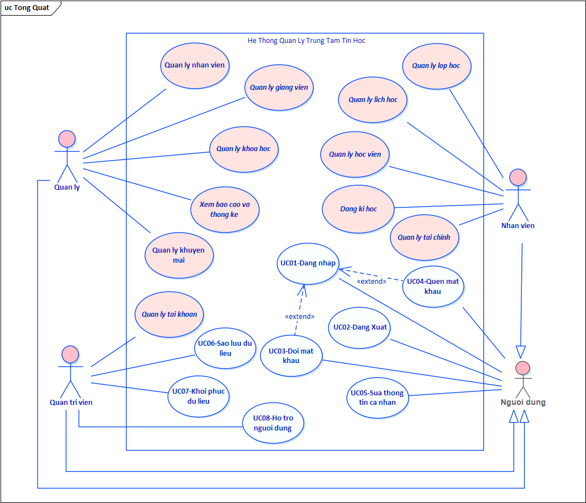

### Activity Diagram

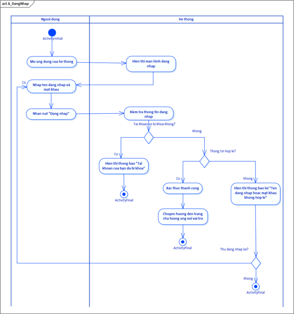

### Sequence Diagram

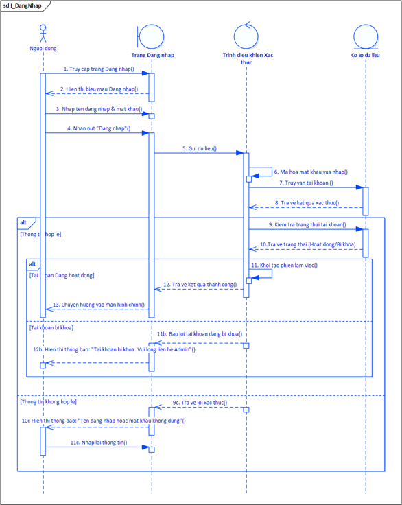

### Collaboration Diagram

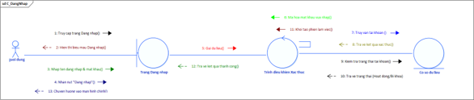

### Class Diagram

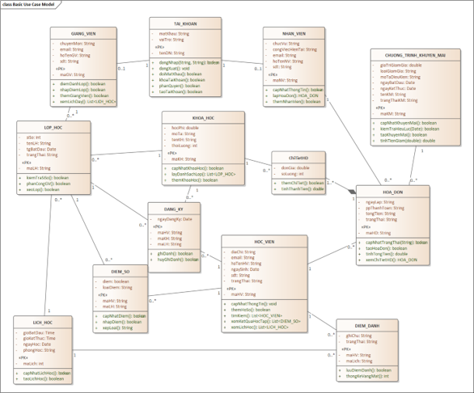

### State Diagram

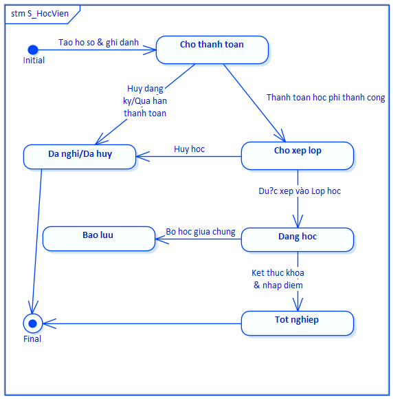

### Component Diagram

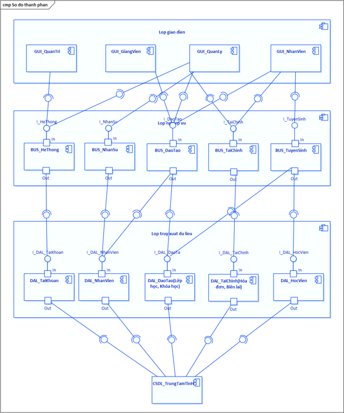

### Deployment Diagram

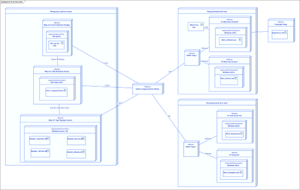

---

## 9. Một số giao diện chương trình minh họa

### Đăng nhập

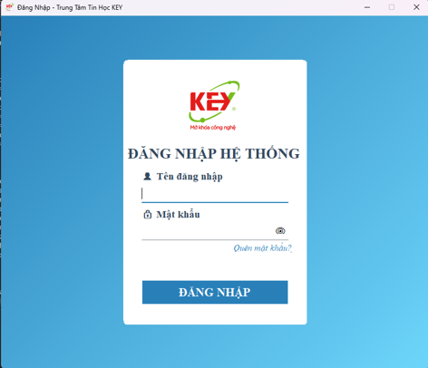

### Màn hình chính vai trò Quản lý

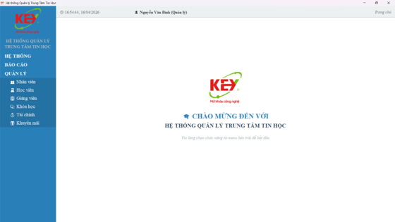

### Quản lý nhân viên

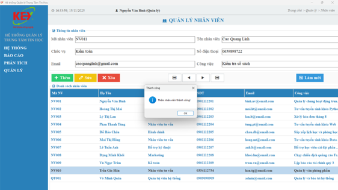

### Quản lý học viên

### Quản lý giảng viên

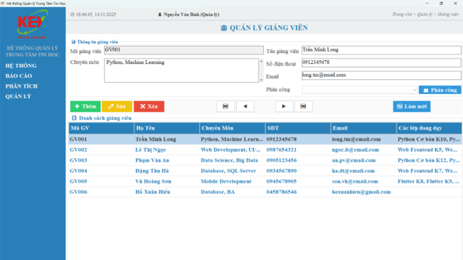

### Quản lý khóa học

### Quản lý lớp học

### Quản lý lịch học

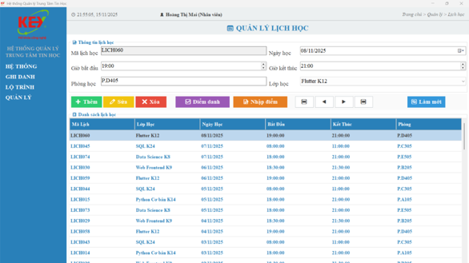

### Quản lý tài chính

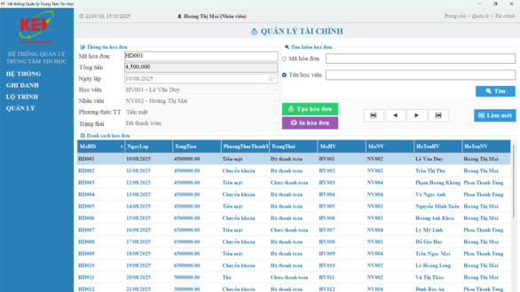

### Quản lý khuyến mãi

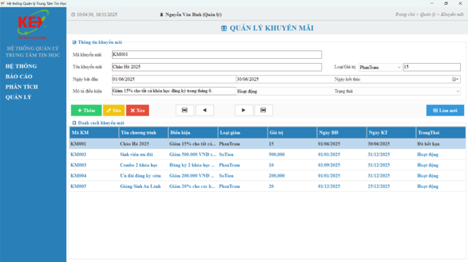

### Sao lưu và phục hồi dữ liệu

### Ghi danh học viên

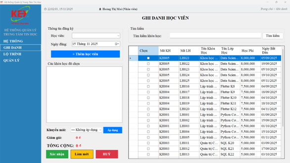

### Báo cáo và thống kê

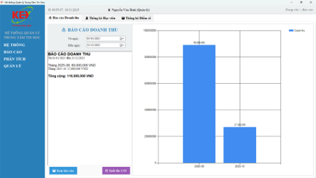
